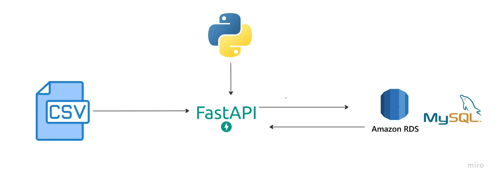
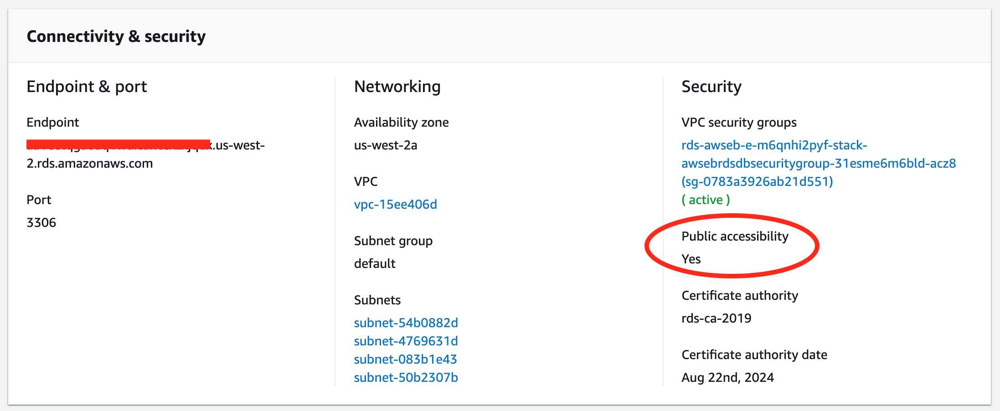
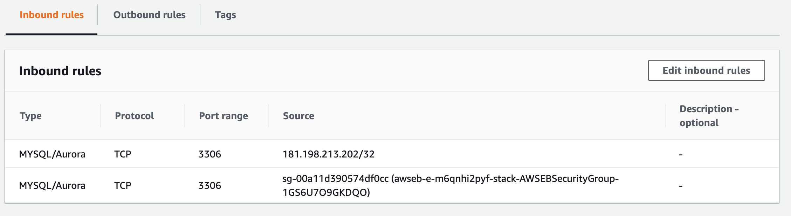
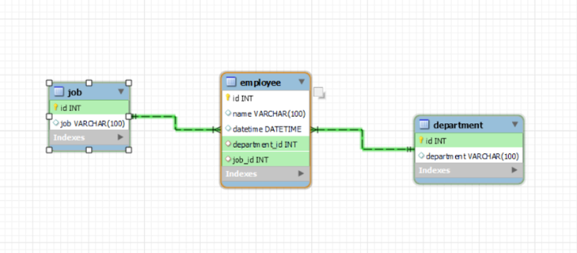
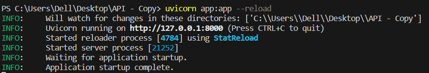

# REST API Solution




A RESTful API for ingesting data into a AWS RDS-MySQL database and retrieving information using GET endpoints.

## Table of Contents

- [Introduction](#introduction)
- [Technologies Used](#technologies-used)
- [Getting Started](#getting-started)
    - [Create a Database](#create-a-database)
    - [Verify Database Connection and Define Model Schemas](#verify-database-connection-and-define-model-schemas)
- [API Endpoints](#api-endpoints)
    - [Create Tables and Ingest Data](#create-tables-and-ingest-data)
    - [Create Foreign Keys](#create-foreign-keys)
    - [Retrieve Employee Information](#retrieve-employee-information)
- [Running the API](#running-the-api)


## Introduction

This project is a RESTful API built using [FastAPI](https://fastapi.tiangolo.com/) that allows you to ingest data from CSV files into a MySQL database and retrieve information about employees and departments using various GET endpoints.

## Technologies Used

- [FastAPI](https://fastapi.tiangolo.com/): A modern, fast web framework for building APIs.
- [SQLAlchemy](https://www.sqlalchemy.org/): A powerful Object-Relational Mapping (ORM) library.
- [Amazon RDS for MySQL](https://aws.amazon.com/es/rds/mysql//): A cloud-based managed relational database service provided by Amazon Web Services.

## Getting Started

### Create a Database

1. In the process of migration, it is essential to select a database for establishing a connection with our API. You are free to opt for a database that aligns with your familiarity and expertise. For the purpose of this guide, I will demonstrate using MySQL as the chosen database.

   ```sql 
   CREATE DATABASE your_data_base;
   ```
### Verify Database Connection and Define Model Schemas
1. Begin by navigating to the 'db.py' file to ensure that your database connection is properly configured and functioning.
2. When utilizing AWS RDS for MySQL, it's crucial to conduct a thorough assessment to ensure seamless connectivity. Begin by verifying that the Public Accessibility setting is configured as 'YES'. 



Subsequently, navigate to the security group settings, access the inbound rules section, and proceed to generate a new rule. This new rule should be based on the IP address retrieved from http://checkip.amazonaws.com/.


3. Define the desired schemas for your tables. In this scenario, we will be creating three tables: 'Employee,' 'Job,' and 'Department.'


## API Endpoints

### Create Tables and Ingest Data
1. Review the POST endpoints utilized in this context, which facilitate the creation of tables and the ingestion of data into those tables. You can find these endpoints within the 'post_endpoints.py' file.

### Create Foreign Keys
1. We will be making alterations to our tables to enable the execution of specific queries through various endpoints in the future.
```sql 
ALTER TABLE employee ADD CONSTRAINT fk_employee_department FOREIGN KEY (department_id) REFERENCES department (id);
 ```
```sql 
ALTER TABLE employee ADD CONSTRAINT fk_employee_job FOREIGN KEY (job_id) REFERENCES job (id);
 ```
2. We aspire to establish a table schema resembling the following::



### Retrieve Employee Information
1. Please examine the 'get_endpoints.py' file to observe the query executions that gather valuable information, instrumental in making significant decisions for the company.
2. The presentation.html file contains comprehensive information about the API, offering a deeper understanding of its functionalities and features.

## Running the API


To consistently verify the proper functioning of your API, utilize the following command: 
```bash
uvicorn app:app --reload. 
```
This ensures that your API is continuously monitored and any issues are promptly identified and resolved.


